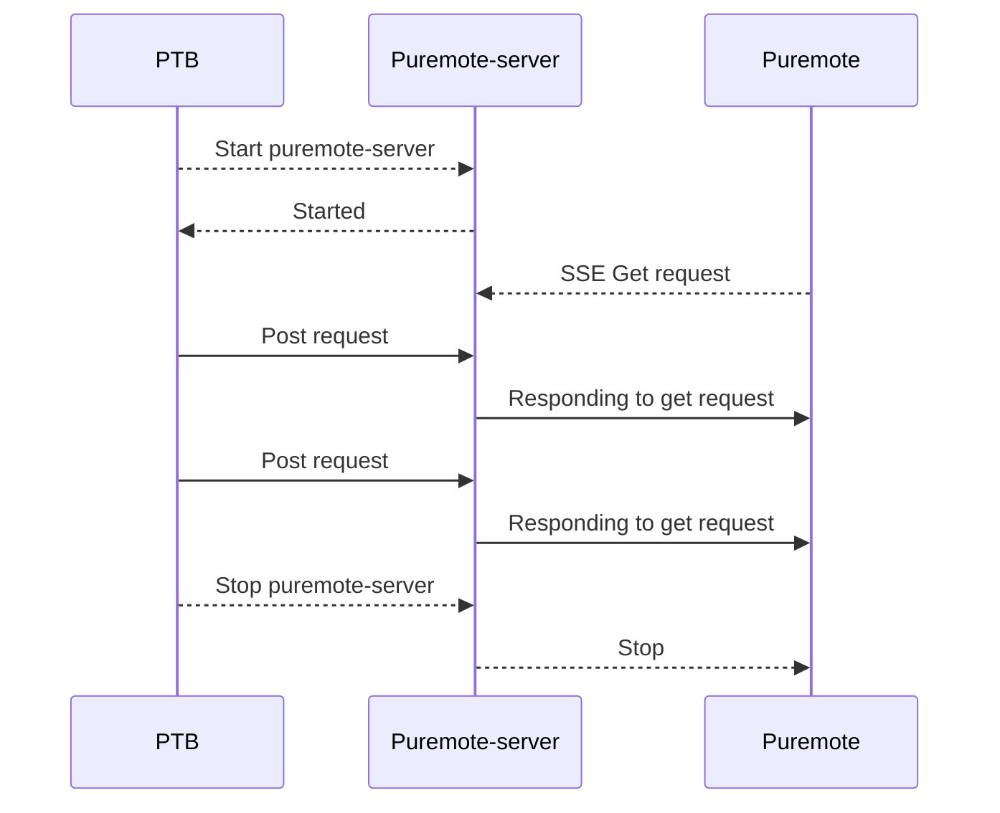

## Puremote-server

This is a middlware server for puremote, which is used to handle data forwarding from other frameworks to puremote, solving the integration problem between puremote and other frameworks, such as the integration of PTB and puremote.

## Architecture
